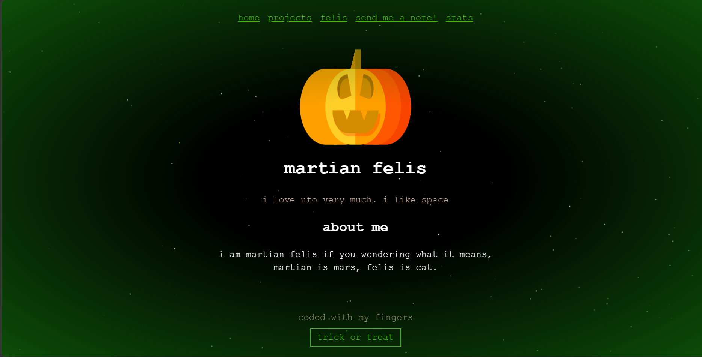
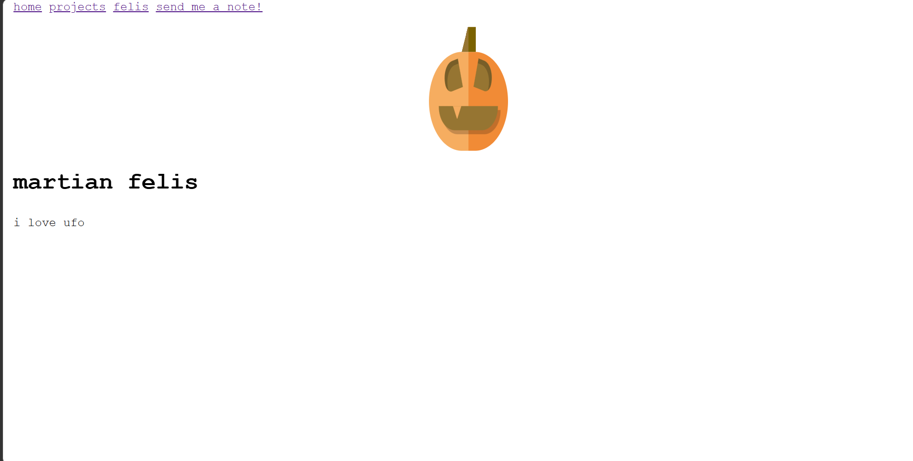
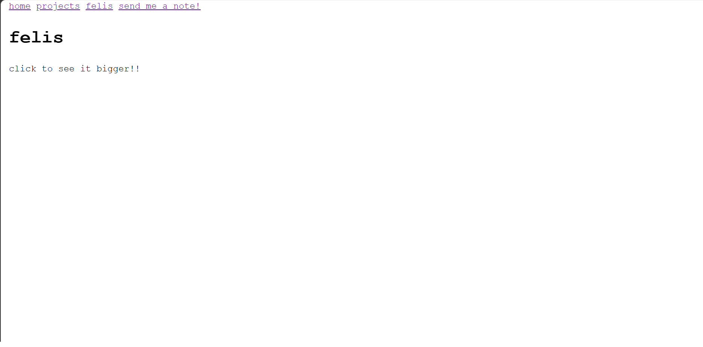
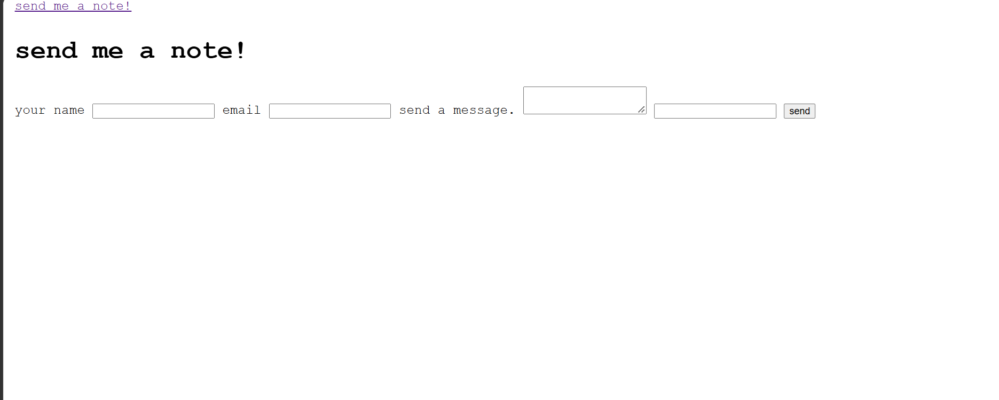
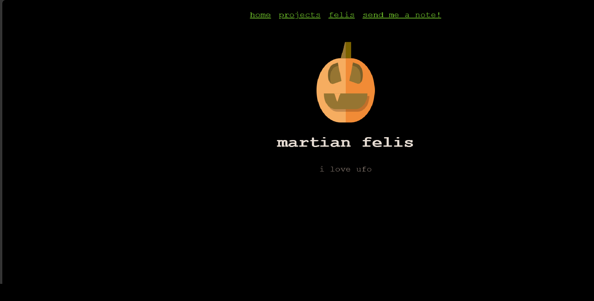
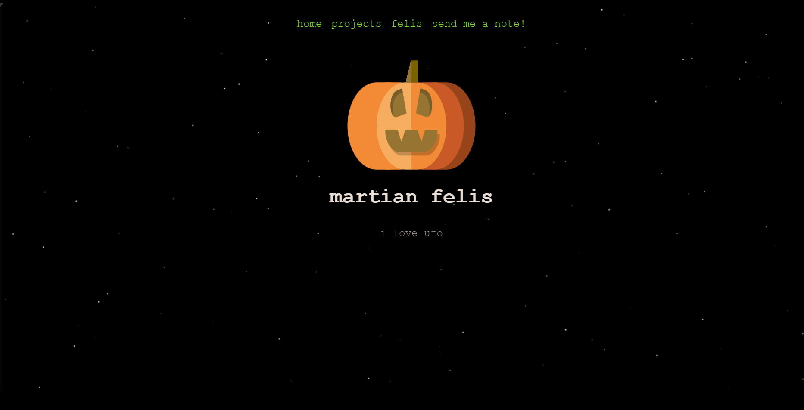
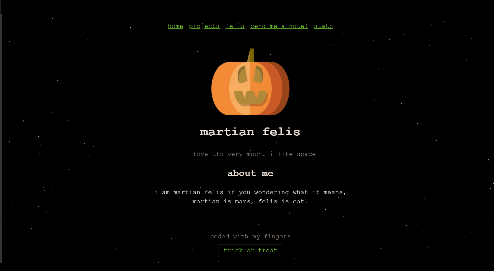
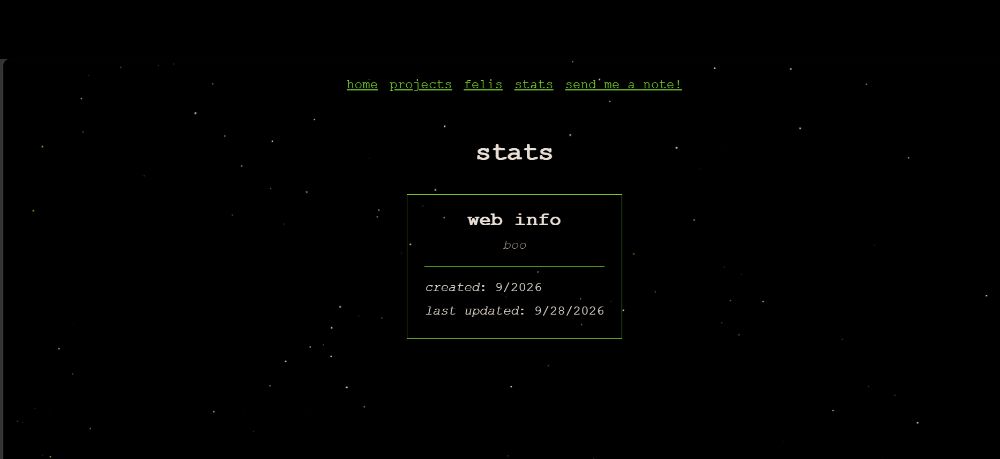
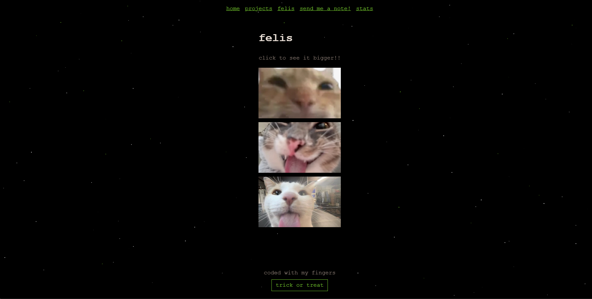
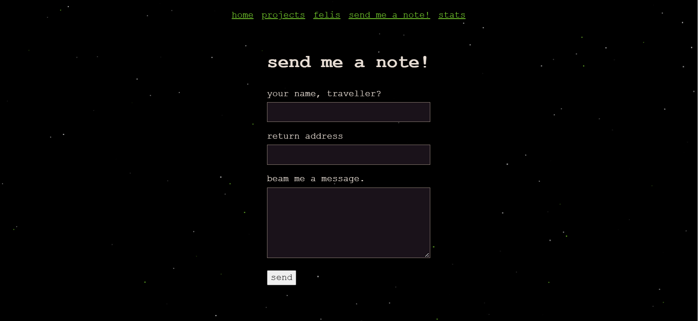

# martianfelis

spooky halloween themed personal website 
(https://okdrinkwater1.github.io/martianfelis/)

## info

i wanted to make a personal website for a long time, finally i got the motivation to do so . it took a long time because of lots of errors but i think it was worth it at the end.

my username is martian felis martian = mars, felis = cat, so i wanted to make something about it , originally i thought of making a mars/space theme but since halloween coming soon i made a pumpkin with css, i learned it from a tutorial , it looks nice init, it has got a nice laugh and teeths. initially i had the stars static but i thought it would look way cooler if it were moving giving a illusion of moving forward in space or something like this. since i wanted to make it a bit spooky i choose like green with the pumpkin's orange. i like plain websites so i kept it simple with the buttons and fonts , lastly i thought of adding a trick or treat button which would make the site a bit more spookier i guess with the green vigilante it took some time to figure it out, i am not sure if it turned out very well but it works i guess.

## what is in it

- moving stars(feels like traversing in space)
- made a pumpkin with css
- personal pages
- felis's
- send me a note (pls)
- update status

## stack used

- html,css,javascript
- used formspree for taking responses
- deployed on github pages

## screenshots

